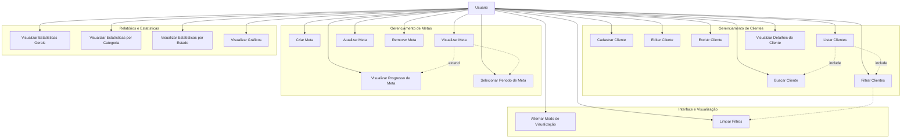
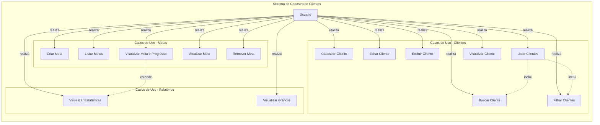

# Diagrama de Casos de Uso - Projeto Impacta

## 📋 Diagrama para MermaidChart

**Copie o código abaixo e cole no MermaidChart:**

---

## Diagrama UML de Casos de Uso (Versão Completa)

## Diagrama Detalhado com Relacionamentos

## Descrição Detalhada dos Casos de Uso

### 1. Gerenciamento de Clientes

#### UC-01: Cadastrar Cliente
**Ator:** Usuário  
**Pré-condições:** Sistema conectado ao banco de dados  
**Fluxo Principal:**
1. Usuário clica em "Novo Cliente"
2. Sistema exibe formulário de cadastro
3. Usuário preenche dados do cliente (nome, email obrigatórios)
4. Sistema valida os dados (formato de email, telefone, CPF)
5. Sistema formata automaticamente telefone e CPF
6. Sistema salva o cliente no banco de dados
7. Sistema exibe mensagem de sucesso
8. Sistema atualiza a lista de clientes

**Fluxos Alternativos:**
- 4a. Dados inválidos: Sistema exibe mensagem de erro
- 5a. Email duplicado: Sistema exibe mensagem de erro

**Pós-condições:** Cliente cadastrado e visível na lista

#### UC-02: Editar Cliente
**Ator:** Usuário  
**Pré-condições:** Cliente existe no sistema  
**Fluxo Principal:**
1. Usuário seleciona um cliente na lista
2. Usuário clica em "Editar"
3. Sistema exibe formulário preenchido com dados do cliente
4. Usuário modifica os dados desejados
5. Sistema valida os dados
6. Sistema atualiza o cliente no banco de dados
7. Sistema exibe mensagem de sucesso
8. Sistema atualiza a lista de clientes

**Pós-condições:** Dados do cliente atualizados

#### UC-03: Excluir Cliente
**Ator:** Usuário  
**Pré-condições:** Cliente existe no sistema  
**Fluxo Principal:**
1. Usuário seleciona um cliente na lista
2. Usuário clica em "Excluir"
3. Sistema exibe modal de confirmação
4. Usuário confirma a exclusão
5. Sistema realiza soft delete (marca como inativo)
6. Sistema exibe mensagem de sucesso
7. Sistema remove o cliente da lista

**Fluxos Alternativos:**
- 4a. Usuário cancela: Sistema fecha o modal sem excluir

**Pós-condições:** Cliente marcado como inativo (soft delete)

#### UC-04: Listar Clientes
**Ator:** Usuário  
**Pré-condições:** Sistema conectado ao banco de dados  
**Fluxo Principal:**
1. Usuário acessa a página principal
2. Sistema carrega todos os clientes ativos
3. Sistema exibe clientes em formato de cards ou lista
4. Sistema ordena por data de cadastro (mais recentes primeiro)

**Pós-condições:** Lista de clientes exibida

#### UC-05: Buscar Cliente
**Ator:** Usuário  
**Pré-condições:** Existem clientes cadastrados  
**Fluxo Principal:**
1. Usuário digita termo de busca no campo de pesquisa
2. Sistema busca em tempo real (debounce de 300ms)
3. Sistema busca por nome, email, telefone ou CPF
4. Sistema exibe resultados filtrados
5. Sistema atualiza contador de resultados

**Pós-condições:** Resultados da busca exibidos

#### UC-06: Filtrar Clientes
**Ator:** Usuário  
**Pré-condições:** Existem clientes cadastrados  
**Fluxo Principal:**
1. Usuário seleciona filtros (categoria, status, estado, valor)
2. Sistema aplica filtros em tempo real
3. Sistema exibe apenas clientes que atendem aos critérios
4. Sistema atualiza contador de resultados

**Filtros Disponíveis:**
- Categoria: VIP, Regular, Lead, Inativo, Outro
- Status de Pagamento: Pago, Pendente, Cancelado
- Estado: Todos os estados brasileiros
- Valor: Mínimo e máximo

**Pós-condições:** Lista filtrada exibida

#### UC-07: Visualizar Detalhes do Cliente
**Ator:** Usuário  
**Pré-condições:** Cliente existe no sistema  
**Fluxo Principal:**
1. Usuário visualiza card do cliente na lista
2. Sistema exibe informações completas:
   - Dados pessoais (nome, email, telefone, CPF)
   - Endereço completo
   - Categoria e status de pagamento
   - Valor associado
   - Data de cadastro
   - Observações

**Pós-condições:** Detalhes do cliente visíveis

### 2. Gerenciamento de Metas

#### UC-08: Criar Meta
**Ator:** Usuário  
**Pré-condições:** Sistema conectado ao banco de dados  
**Fluxo Principal:**
1. Usuário clica em "Nova Meta"
2. Sistema exibe formulário de meta
3. Usuário preenche período (mês e ano obrigatórios)
4. Usuário define metas (novos clientes, valores, retenção)
5. Sistema valida período único
6. Sistema salva a meta no banco de dados
7. Sistema exibe mensagem de sucesso
8. Sistema atualiza dashboard de metas

**Fluxos Alternativos:**
- 5a. Meta já existe para o período: Sistema exibe erro

**Pós-condições:** Meta criada e visível no dashboard

#### UC-09: Listar Metas
**Ator:** Usuário  
**Pré-condições:** Sistema conectado ao banco de dados  
**Fluxo Principal:**
1. Usuário acessa seção de metas
2. Sistema carrega todas as metas (opcionalmente filtradas por ano)
3. Sistema exibe metas ordenadas por período

**Pós-condições:** Lista de metas exibida

#### UC-10: Visualizar Meta e Progresso
**Ator:** Usuário  
**Pré-condições:** Meta existe no sistema  
**Fluxo Principal:**
1. Usuário seleciona período de meta
2. Sistema busca meta do período
3. Sistema calcula métricas reais do período
4. Sistema calcula percentuais de progresso
5. Sistema exibe:
   - Meta definida
   - Valores realizados
   - Percentual de progresso
   - Barra de progresso visual

**Métricas Calculadas:**
- Novos clientes no período
- Valor pago no período
- Valor pendente no período
- Taxa de retenção

**Pós-condições:** Dashboard de progresso exibido

#### UC-11: Atualizar Meta
**Ator:** Usuário  
**Pré-condições:** Meta existe no sistema  
**Fluxo Principal:**
1. Usuário seleciona meta existente
2. Usuário modifica valores das metas
3. Sistema valida os dados
4. Sistema atualiza a meta no banco de dados
5. Sistema exibe mensagem de sucesso
6. Sistema atualiza dashboard

**Pós-condições:** Meta atualizada

#### UC-12: Remover Meta
**Ator:** Usuário  
**Pré-condições:** Meta existe no sistema  
**Fluxo Principal:**
1. Usuário seleciona meta para remover
2. Sistema solicita confirmação
3. Usuário confirma remoção
4. Sistema remove a meta do banco de dados
5. Sistema exibe mensagem de sucesso
6. Sistema atualiza lista de metas

**Pós-condições:** Meta removida do sistema

#### UC-13: Selecionar Período de Meta
**Ator:** Usuário  
**Pré-condições:** Existem metas cadastradas  
**Fluxo Principal:**
1. Usuário seleciona período no dropdown
2. Sistema carrega meta do período selecionado
3. Sistema calcula e exibe progresso

**Pós-condições:** Meta do período selecionado exibida

### 3. Relatórios e Estatísticas

#### UC-14: Visualizar Estatísticas Gerais
**Ator:** Usuário  
**Pré-condições:** Sistema conectado ao banco de dados  
**Fluxo Principal:**
1. Sistema carrega automaticamente ao acessar a página
2. Sistema calcula estatísticas agregadas:
   - Total de clientes
   - Clientes cadastrados hoje
   - Total de pagamentos confirmados
   - Total de pagamentos pendentes
   - Valor total
   - Valor pago
   - Valor pendente
3. Sistema exibe estatísticas em cards visuais

**Pós-condições:** Estatísticas gerais exibidas

#### UC-15: Visualizar Estatísticas por Categoria
**Ator:** Usuário  
**Pré-condições:** Existem clientes cadastrados  
**Fluxo Principal:**
1. Sistema carrega dados agregados por categoria
2. Sistema calcula total de clientes e valor total por categoria
3. Sistema exibe gráfico de pizza (doughnut chart)
4. Sistema ordena categorias por quantidade

**Pós-condições:** Gráfico de categorias exibido

#### UC-16: Visualizar Estatísticas por Estado
**Ator:** Usuário  
**Pré-condições:** Existem clientes com estado cadastrado  
**Fluxo Principal:**
1. Sistema carrega dados agregados por estado
2. Sistema calcula total de clientes por estado
3. Sistema exibe gráfico de barras horizontais
4. Sistema limita aos 10 estados com mais clientes
5. Sistema ordena por quantidade (decrescente)

**Pós-condições:** Gráfico de estados exibido

#### UC-17: Visualizar Gráficos
**Ator:** Usuário  
**Pré-condições:** Existem dados para visualizar  
**Fluxo Principal:**
1. Sistema carrega automaticamente os gráficos
2. Sistema exibe três gráficos:
   - Gráfico de Pizza: Clientes por Categoria
   - Gráfico de Barras: Status de Pagamento
   - Gráfico de Barras Horizontais: Clientes por Estado
3. Gráficos são atualizados automaticamente quando dados mudam

**Pós-condições:** Gráficos exibidos e atualizados

### 4. Interface e Visualização

#### UC-18: Alternar Modo de Visualização
**Ator:** Usuário  
**Pré-condições:** Lista de clientes carregada  
**Fluxo Principal:**
1. Usuário clica em botão de visualização (grid ou lista)
2. Sistema alterna entre:
   - Modo Grid: Cards em grade
   - Modo Lista: Cards em lista vertical
3. Sistema mantém preferência durante a sessão

**Pós-condições:** Modo de visualização alterado

#### UC-19: Limpar Filtros
**Ator:** Usuário  
**Pré-condições:** Filtros aplicados  
**Fluxo Principal:**
1. Usuário clica em "Limpar Filtros"
2. Sistema remove todos os filtros aplicados
3. Sistema limpa campo de busca
4. Sistema exibe todos os clientes novamente
5. Sistema atualiza contador

**Pós-condições:** Todos os filtros removidos, lista completa exibida

## Matriz de Rastreabilidade

| Caso de Uso | Requisito Funcional | Prioridade |
|------------|---------------------|------------|
| UC-01: Cadastrar Cliente | RF-001 | Alta |
| UC-02: Editar Cliente | RF-002 | Alta |
| UC-03: Excluir Cliente | RF-003 | Alta |
| UC-04: Listar Clientes | RF-004 | Alta |
| UC-05: Buscar Cliente | RF-005 | Média |
| UC-06: Filtrar Clientes | RF-006 | Média |
| UC-07: Visualizar Cliente | RF-007 | Alta |
| UC-08: Criar Meta | RF-008 | Alta |
| UC-09: Listar Metas | RF-009 | Média |
| UC-10: Visualizar Progresso | RF-010 | Alta |
| UC-11: Atualizar Meta | RF-011 | Média |
| UC-12: Remover Meta | RF-012 | Baixa |
| UC-13: Selecionar Período | RF-013 | Média |
| UC-14: Estatísticas Gerais | RF-014 | Alta |
| UC-15: Estatísticas por Categoria | RF-015 | Média |
| UC-16: Estatísticas por Estado | RF-016 | Baixa |
| UC-17: Visualizar Gráficos | RF-017 | Média |
| UC-18: Alternar Visualização | RF-018 | Baixa |
| UC-19: Limpar Filtros | RF-019 | Baixa |

## Relacionamentos entre Casos de Uso

### Inclusão (Include)
- **UC-04** inclui **UC-05** (Listar inclui Buscar)
- **UC-04** inclui **UC-06** (Listar inclui Filtrar)

### Extensão (Extend)
- **UC-10** estende **UC-14** (Visualizar Progresso estende Estatísticas)

### Generalização
- Todos os casos de uso são generalizações do ator **Usuário**

## Observações Técnicas

1. **Validações Automáticas:**
   - Formatação de telefone e CPF no frontend e backend
   - Validação de email com regex
   - Validação de estados brasileiros (enum)
   - Validação de categorias e status (enum)

2. **Performance:**
   - Busca com debounce (300ms) para evitar requisições excessivas
   - Índices no banco de dados para otimizar buscas
   - Agregações MongoDB para estatísticas eficientes

3. **UX/UI:**
   - Notificações de sucesso/erro
   - Loading states durante carregamento
   - Animações suaves nas transições
   - Responsividade para diferentes dispositivos

4. **Segurança:**
   - Validação de dados no frontend e backend
   - Sanitização de inputs
   - Soft delete para preservar histórico

