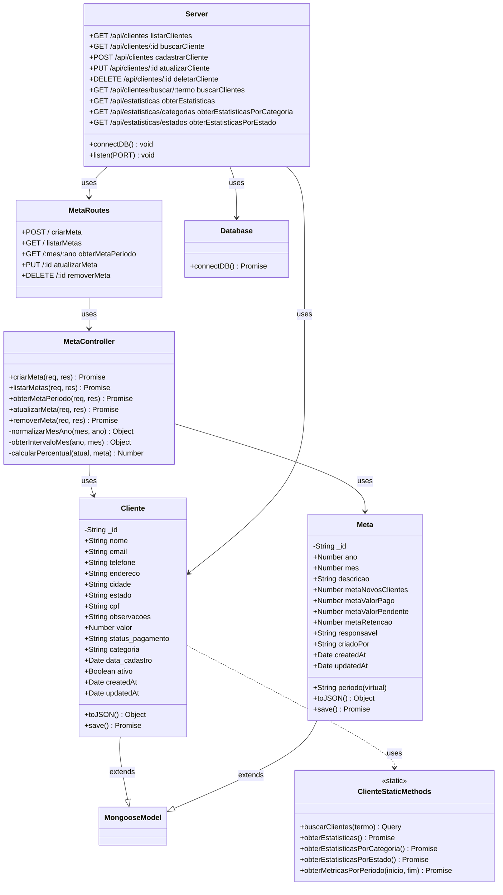

# Diagrama de Classes - Projeto Impacta

## Diagrama UML de Classes

## Descrição das Classes

### Cliente
**Modelo principal do sistema de clientes**

**Atributos:**
- `nome` (String, obrigatório): Nome do cliente (2-100 caracteres)
- `email` (String, obrigatório): Email válido do cliente
- `telefone` (String, opcional): Telefone formatado (XX) XXXX-XXXX
- `endereco` (String, opcional): Endereço completo (máx. 200 caracteres)
- `cidade` (String, opcional): Cidade (máx. 50 caracteres)
- `estado` (String, opcional): Estado brasileiro (sigla de 2 letras)
- `cpf` (String, opcional): CPF formatado XXX.XXX.XXX-XX
- `observacoes` (String, opcional): Observações sobre o cliente (máx. 500 caracteres)
- `valor` (Number, default: 0): Valor associado ao cliente
- `status_pagamento` (String, enum): 'pago', 'pendente', 'cancelado'
- `categoria` (String, enum): 'VIP', 'Regular', 'Lead', 'Inativo', 'Outro'
- `data_cadastro` (Date): Data de cadastro do cliente
- `ativo` (Boolean, default: true): Indica se o cliente está ativo

**Métodos de Instância:**
- `toJSON()`: Converte o documento para JSON, substituindo `_id` por `id`

**Métodos Estáticos:**
- `buscarClientes(termo)`: Busca clientes por nome, email, telefone ou CPF
- `obterEstatisticas()`: Retorna estatísticas gerais dos clientes
- `obterEstatisticasPorCategoria()`: Retorna estatísticas agrupadas por categoria
- `obterEstatisticasPorEstado()`: Retorna estatísticas agrupadas por estado
- `obterMetricasPorPeriodo(inicio, fim)`: Retorna métricas para um período específico

### Meta
**Modelo para gerenciamento de metas mensais**

**Atributos:**
- `ano` (Number, obrigatório): Ano da meta (2000-2100)
- `mes` (Number, obrigatório): Mês da meta (1-12)
- `descricao` (String, opcional): Descrição da meta (máx. 200 caracteres)
- `metaNovosClientes` (Number, default: 0): Meta de novos clientes
- `metaValorPago` (Number, default: 0): Meta de valor pago
- `metaValorPendente` (Number, default: 0): Meta de valor pendente
- `metaRetencao` (Number, default: 0): Meta de retenção (0-100%)
- `responsavel` (String, opcional): Responsável pela meta (máx. 100 caracteres)
- `criadoPor` (String, opcional): Usuário que criou a meta (máx. 100 caracteres)

**Propriedades Virtuais:**
- `periodo` (String, virtual): Retorna o período formatado como "MM/AAAA"

**Métodos de Instância:**
- `toJSON()`: Converte o documento para JSON, incluindo propriedades virtuais

### MetaController
**Controller para gerenciar operações de metas**

**Métodos Públicos:**
- `criarMeta(req, res)`: Cria uma nova meta para um período
- `listarMetas(req, res)`: Lista todas as metas (opcionalmente filtradas por ano)
- `obterMetaPeriodo(req, res)`: Obtém meta e progresso para um período específico
- `atualizarMeta(req, res)`: Atualiza uma meta existente
- `removerMeta(req, res)`: Remove uma meta

**Métodos Privados:**
- `normalizarMesAno(mes, ano)`: Normaliza e valida mês e ano
- `obterIntervaloMes(ano, mes)`: Calcula intervalo de datas do mês
- `calcularPercentual(atual, meta)`: Calcula percentual de progresso

### MetaRoutes
**Rotas Express para operações de metas (router do Express)**

**Endpoints:**
- `POST /`: Criar nova meta
- `GET /`: Listar metas
- `GET /:mes/:ano`: Obter meta e progresso de um período
- `PUT /:id`: Atualizar meta
- `DELETE /:id`: Remover meta

### Server
**Servidor Express principal da aplicação**

**Funcionalidades:**
- Configuração de middlewares (CORS, body-parser)
- Rotas de API para clientes
- Rotas de API para estatísticas
- Servir arquivos estáticos
- Integração com rotas de metas
- Gerenciamento de conexão com banco de dados

**Endpoints de Clientes:**
- `GET /api/clientes`: Listar todos os clientes ativos
- `GET /api/clientes/:id`: Buscar cliente por ID
- `POST /api/clientes`: Cadastrar novo cliente
- `PUT /api/clientes/:id`: Atualizar cliente
- `DELETE /api/clientes/:id`: Deletar cliente (soft delete)
- `GET /api/clientes/buscar/:termo`: Buscar clientes por termo

**Endpoints de Estatísticas:**
- `GET /api/estatisticas`: Estatísticas gerais
- `GET /api/estatisticas/categorias`: Estatísticas por categoria
- `GET /api/estatisticas/estados`: Estatísticas por estado

### Database
**Módulo de configuração e conexão com MongoDB**

**Métodos:**
- `connectDB()`: Estabelece conexão com MongoDB e configura eventos de conexão

## Relacionamentos

1. **Cliente** e **Meta** são modelos Mongoose que estendem **MongooseModel** (classe auxiliar que representa `mongoose.Model`)
2. **MetaController** utiliza **Meta** e **Cliente** para realizar operações
3. **MetaRoutes** utiliza **MetaController** para definir rotas
4. **Server** utiliza **Cliente**, **MetaRoutes** e **Database**
5. **ClienteStaticMethods** contém métodos estáticos utilizados pelo modelo **Cliente**

## Observações Técnicas

- Todos os modelos utilizam `timestamps: true` para `createdAt` e `updatedAt` automáticos
- Soft delete implementado no modelo Cliente através do campo `ativo`
- Validações de formato implementadas via regex nos schemas
- Middlewares pré-save formatam telefone e CPF automaticamente
- Índices criados para otimizar buscas de texto e ordenação

