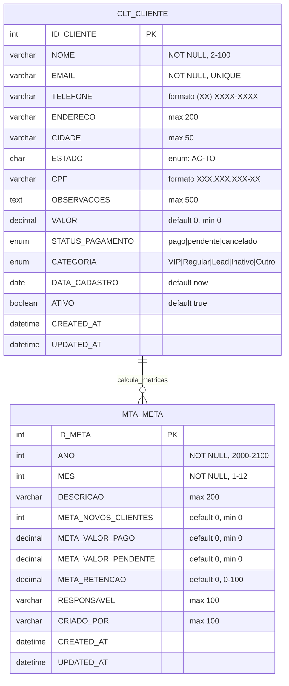
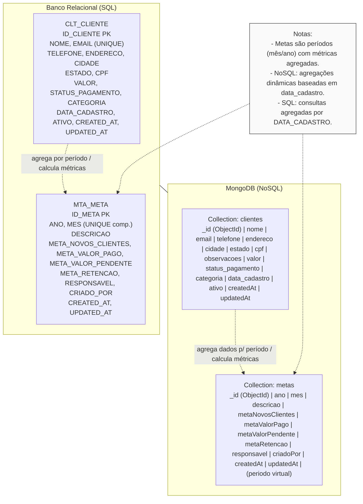
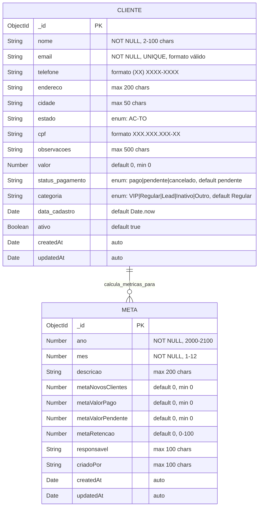
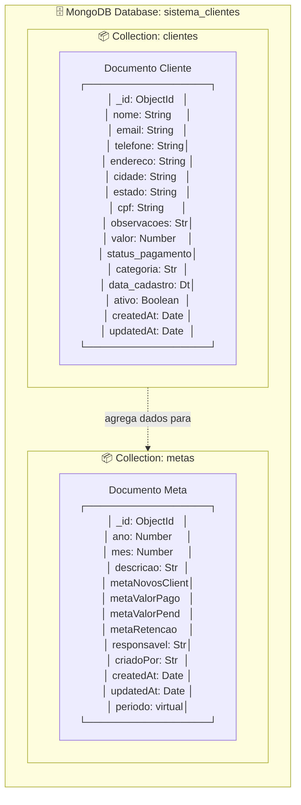

# Modelo de Dados - Projeto Impacta

## Diagrama Entidade-Relacionamento (ER) - Modelo Relacional



## Diagrama de Modelo de Dados - Visualização Detalhada

```mermaid
---
config:
  theme: default
---

flowchart TB
    subgraph CLT_CLIENTE["📋 CLT_CLIENTE"]
        direction TB
        PK1["🔑 ID_CLIENTE: INT (PK)"]
        A1["NOME: VARCHAR(100) NOT NULL"]
        A2["EMAIL: VARCHAR(255) NOT NULL UNIQUE"]
        A3["TELEFONE: VARCHAR(20)"]
        A4["ENDERECO: VARCHAR(200)"]
        A5["CIDADE: VARCHAR(50)"]
        A6["ESTADO: CHAR(2)"]
        A7["CPF: VARCHAR(14)"]
        A8["OBSERVACOES: TEXT"]
        A9["VALOR: DECIMAL(10,2) DEFAULT 0"]
        A10["STATUS_PAGAMENTO: ENUM"]
        A11["CATEGORIA: ENUM"]
        A12["DATA_CADASTRO: DATE"]
        A13["ATIVO: BOOLEAN DEFAULT TRUE"]
        A14["CREATED_AT: DATETIME"]
        A15["UPDATED_AT: DATETIME"]
    end
    
    subgraph MTA_META["🎯 MTA_META"]
        direction TB
        PK2["🔑 ID_META: INT (PK)"]
        B1["ANO: INT NOT NULL"]
        B2["MES: INT NOT NULL"]
        B3["DESCRICAO: VARCHAR(200)"]
        B4["META_NOVOS_CLIENTES: INT"]
        B5["META_VALOR_PAGO: DECIMAL(10,2)"]
        B6["META_VALOR_PENDENTE: DECIMAL(10,2)"]
        B7["META_RETENCAO: DECIMAL(5,2)"]
        B8["RESPONSAVEL: VARCHAR(100)"]
        B9["CRIADO_POR: VARCHAR(100)"]
        B10["CREATED_AT: DATETIME"]
        B11["UPDATED_AT: DATETIME"]
    end
    
    CLT_CLIENTE -.->|"agrega dados por período<br/>calcula métricas"| MTA_META
```



## Diagrama Comparativo: Modelo Relacional vs MongoDB



## Diagrama Entidade-Relacionamento (ER) - MongoDB/NoSQL



## Diagrama de Modelo de Dados Detalhado

```mermaid
---
config:
  theme: default
---

flowchart TB
    subgraph Cliente["📊 ENTIDADE: CLIENTE"]
        direction TB
        PK1["🔑 _id: ObjectId (PK)"]
        A1["nome: String (NOT NULL, 2-100)"]
        A2["email: String (NOT NULL, UNIQUE)"]
        A3["telefone: String (opcional)"]
        A4["endereco: String (opcional, max 200)"]
        A5["cidade: String (opcional, max 50)"]
        A6["estado: String (enum: AC-TO)"]
        A7["cpf: String (opcional, formato)"]
        A8["observacoes: String (opcional, max 500)"]
        A9["valor: Number (default 0, min 0)"]
        A10["status_pagamento: String (enum, default pendente)"]
        A11["categoria: String (enum, default Regular)"]
        A12["data_cadastro: Date (default now)"]
        A13["ativo: Boolean (default true)"]
        A14["createdAt: Date (auto)"]
        A15["updatedAt: Date (auto)"]
    end
    
    subgraph Meta["🎯 ENTIDADE: META"]
        direction TB
        PK2["🔑 _id: ObjectId (PK)"]
        B1["ano: Number (NOT NULL, 2000-2100)"]
        B2["mes: Number (NOT NULL, 1-12)"]
        B3["descricao: String (opcional, max 200)"]
        B4["metaNovosClientes: Number (default 0)"]
        B5["metaValorPago: Number (default 0)"]
        B6["metaValorPendente: Number (default 0)"]
        B7["metaRetencao: Number (default 0, 0-100)"]
        B8["responsavel: String (opcional, max 100)"]
        B9["criadoPor: String (opcional, max 100)"]
        B10["createdAt: Date (auto)"]
        B11["updatedAt: Date (auto)"]
        B12["periodo: String (virtual, MM/AAAA)"]
    end
    
    Cliente -.->|"calcula métricas para"| Meta
```



## Modelo Relacional Detalhado (Estilo SQL)

### Estrutura das Tabelas

#### Tabela: CLT_CLIENTE

| Coluna | Tipo | Constraint | Descrição |
|--------|-----|------------|-----------|
| `ID_CLIENTE` | INT | PK, NOT NULL, AUTO_INCREMENT | Identificador único do cliente |
| `NOME` | VARCHAR(100) | NOT NULL | Nome do cliente (2-100 caracteres) |
| `EMAIL` | VARCHAR(255) | NOT NULL, UNIQUE | Email do cliente (formato válido) |
| `TELEFONE` | VARCHAR(20) | NULL | Telefone formatado (XX) XXXX-XXXX |
| `ENDERECO` | VARCHAR(200) | NULL | Endereço completo |
| `CIDADE` | VARCHAR(50) | NULL | Cidade |
| `ESTADO` | CHAR(2) | NULL, CHECK | Estado brasileiro (AC-TO) |
| `CPF` | VARCHAR(14) | NULL | CPF formatado XXX.XXX.XXX-XX |
| `OBSERVACOES` | TEXT | NULL | Observações sobre o cliente (max 500) |
| `VALOR` | DECIMAL(10,2) | DEFAULT 0, CHECK >= 0 | Valor associado ao cliente |
| `STATUS_PAGAMENTO` | ENUM('pago','pendente','cancelado') | DEFAULT 'pendente' | Status de pagamento |
| `CATEGORIA` | ENUM('VIP','Regular','Lead','Inativo','Outro') | DEFAULT 'Regular' | Categoria do cliente |
| `DATA_CADASTRO` | DATE | DEFAULT CURRENT_DATE | Data de cadastro |
| `ATIVO` | BOOLEAN | DEFAULT TRUE | Flag para soft delete |
| `CREATED_AT` | DATETIME | DEFAULT CURRENT_TIMESTAMP | Timestamp de criação |
| `UPDATED_AT` | DATETIME | DEFAULT CURRENT_TIMESTAMP ON UPDATE | Timestamp de atualização |

**Índices:**
- PRIMARY KEY: `ID_CLIENTE`
- UNIQUE: `EMAIL`
- INDEX: `DATA_CADASTRO` (DESC)
- FULLTEXT: `NOME`, `EMAIL`

---

#### Tabela: MTA_META

| Coluna | Tipo | Constraint | Descrição |
|--------|-----|------------|-----------|
| `ID_META` | INT | PK, NOT NULL, AUTO_INCREMENT | Identificador único da meta |
| `ANO` | INT | NOT NULL, CHECK (2000-2100) | Ano da meta |
| `MES` | INT | NOT NULL, CHECK (1-12) | Mês da meta |
| `DESCRICAO` | VARCHAR(200) | NULL | Descrição da meta |
| `META_NOVOS_CLIENTES` | INT | DEFAULT 0, CHECK >= 0 | Meta de novos clientes |
| `META_VALOR_PAGO` | DECIMAL(10,2) | DEFAULT 0, CHECK >= 0 | Meta de valor pago |
| `META_VALOR_PENDENTE` | DECIMAL(10,2) | DEFAULT 0, CHECK >= 0 | Meta de valor pendente |
| `META_RETENCAO` | DECIMAL(5,2) | DEFAULT 0, CHECK (0-100) | Meta de retenção (%) |
| `RESPONSAVEL` | VARCHAR(100) | NULL | Responsável pela meta |
| `CRIADO_POR` | VARCHAR(100) | NULL | Usuário que criou a meta |
| `CREATED_AT` | DATETIME | DEFAULT CURRENT_TIMESTAMP | Timestamp de criação |
| `UPDATED_AT` | DATETIME | DEFAULT CURRENT_TIMESTAMP ON UPDATE | Timestamp de atualização |

**Índices:**
- PRIMARY KEY: `ID_META`
- UNIQUE: `(ANO, MES)` - Garante unicidade do período

---

### Relacionamentos

**CLT_CLIENTE ↔ MTA_META:**
- **Tipo:** Relacionamento de cálculo/agregação (não há FK física)
- **Descrição:** As métricas da meta são calculadas dinamicamente através de consultas SQL agregando dados dos clientes por período
- **Como funciona:** 
  - Uma meta define objetivos para um período (ano/mês)
  - Consultas SQL agregam dados de `CLT_CLIENTE` filtrando por `DATA_CADASTRO` dentro do período
  - Calcula: novos clientes, valor pago, valor pendente, retenção

**Exemplo de Consulta:**
```sql
SELECT 
    COUNT(*) as novos_clientes,
    SUM(CASE WHEN STATUS_PAGAMENTO = 'pago' THEN VALOR ELSE 0 END) as valor_pago,
    SUM(CASE WHEN STATUS_PAGAMENTO = 'pendente' THEN VALOR ELSE 0 END) as valor_pendente
FROM CLT_CLIENTE
WHERE DATA_CADASTRO >= '2024-01-01' 
  AND DATA_CADASTRO < '2024-02-01'
  AND ATIVO = TRUE;
```

---

## Especificação Detalhada das Entidades

### 📊 Entidade: CLIENTE

**Coleção MongoDB:** `clientes`

| Atributo | Tipo | Obrigatório | Validação/Regras | Default | Índices |
|----------|------|-------------|------------------|---------|---------|
| `_id` | ObjectId | Sim | Chave Primária | Auto | PK |
| `nome` | String | Sim | 2-100 caracteres, trim | - | Text index |
| `email` | String | Sim | Formato válido, lowercase, trim | - | Text index, UNIQUE |
| `telefone` | String | Não | Formato (XX) XXXX-XXXX | - | - |
| `endereco` | String | Não | Máx. 200 caracteres, trim | - | - |
| `cidade` | String | Não | Máx. 50 caracteres, trim | - | - |
| `estado` | String | Não | Enum: AC, AL, AP, AM, BA, CE, DF, ES, GO, MA, MT, MS, MG, PA, PB, PR, PE, PI, RJ, RN, RS, RO, RR, SC, SP, SE, TO | - | - |
| `cpf` | String | Não | Formato XXX.XXX.XXX-XX | - | - |
| `observacoes` | String | Não | Máx. 500 caracteres, trim | - | - |
| `valor` | Number | Não | Mín. 0 | 0 | - |
| `status_pagamento` | String | Não | Enum: 'pago', 'pendente', 'cancelado' | 'pendente' | - |
| `categoria` | String | Não | Enum: 'VIP', 'Regular', 'Lead', 'Inativo', 'Outro' | 'Regular' | - |
| `data_cadastro` | Date | Não | Data de cadastro | Date.now | Index (-1) |
| `ativo` | Boolean | Não | Soft delete flag | true | - |
| `createdAt` | Date | Auto | Timestamp de criação | Auto | - |
| `updatedAt` | Date | Auto | Timestamp de atualização | Auto | - |

**Índices:**
- Text index em `nome` e `email` para buscas
- Index em `data_cadastro` (descendente) para ordenação

**Métodos Estáticos:**
- `buscarClientes(termo)`: Busca por nome, email, telefone ou CPF
- `obterEstatisticas()`: Estatísticas agregadas
- `obterEstatisticasPorCategoria()`: Agrupamento por categoria
- `obterEstatisticasPorEstado()`: Agrupamento por estado
- `obterMetricasPorPeriodo(inicio, fim)`: Métricas para período específico

**Métodos de Instância:**
- `toJSON()`: Converte `_id` para `id`

**Middlewares:**
- `pre('save')`: Formata telefone e CPF automaticamente

---

### 🎯 Entidade: META

**Coleção MongoDB:** `metas`

| Atributo | Tipo | Obrigatório | Validação/Regras | Default | Índices |
|----------|------|-------------|------------------|---------|---------|
| `_id` | ObjectId | Sim | Chave Primária | Auto | PK |
| `ano` | Number | Sim | 2000-2100 | - | Unique (ano, mes) |
| `mes` | Number | Sim | 1-12 | - | Unique (ano, mes) |
| `descricao` | String | Não | Máx. 200 caracteres, trim | - | - |
| `metaNovosClientes` | Number | Não | Mín. 0 | 0 | - |
| `metaValorPago` | Number | Não | Mín. 0 | 0 | - |
| `metaValorPendente` | Number | Não | Mín. 0 | 0 | - |
| `metaRetencao` | Number | Não | 0-100 (percentual) | 0 | - |
| `responsavel` | String | Não | Máx. 100 caracteres, trim | - | - |
| `criadoPor` | String | Não | Máx. 100 caracteres, trim | - | - |
| `createdAt` | Date | Auto | Timestamp de criação | Auto | - |
| `updatedAt` | Date | Auto | Timestamp de atualização | Auto | - |
| `periodo` | String | Virtual | Formato MM/AAAA | Calculado | - |

**Índices:**
- Unique index composto em `(ano, mes)` para garantir unicidade do período

**Propriedades Virtuais:**
- `periodo`: Retorna formato "MM/AAAA" baseado em `mes` e `ano`

**Métodos de Instância:**
- `toJSON()`: Converte `_id` para `id` e inclui propriedades virtuais

---

## Relacionamentos

### Relacionamento Conceitual: CLIENTE → META

**Tipo:** Relacionamento de cálculo/agregação (não é FK no MongoDB)

**Descrição:**
- A entidade **META** não possui chave estrangeira para **CLIENTE**
- As métricas da meta são calculadas dinamicamente através de agregações MongoDB
- O relacionamento é temporal: uma meta calcula métricas dos clientes cadastrados em um período específico (mês/ano)

**Como funciona:**
1. Uma **META** define objetivos para um período (mês/ano)
2. O sistema consulta a coleção **CLIENTE** filtrando por `data_cadastro` dentro do período
3. Calcula métricas agregadas:
   - Novos clientes no período
   - Valor pago no período
   - Valor pendente no período
   - Taxa de retenção

**Exemplo de Agregação:**
```javascript
Cliente.obterMetricasPorPeriodo(inicio, fim)
// Retorna métricas calculadas dos clientes do período
```

---

## Diagrama de Modelo de Dados MongoDB (NoSQL)



## Validações e Constraints

### Cliente

**Validações de Formato:**
- **Email:** Regex: `/^\w+([.-]?\w+)*@\w+([.-]?\w+)*(\.\w{2,3})+$/`
- **Telefone:** Regex: `/^\(\d{2}\)\s\d{4,5}-\d{4}$/`
- **CPF:** Regex: `/^\d{3}\.\d{3}\.\d{3}-\d{2}$/`

**Validações de Enum:**
- **Estado:** 27 estados brasileiros (AC, AL, AP, AM, BA, CE, DF, ES, GO, MA, MT, MS, MG, PA, PB, PR, PE, PI, RJ, RN, RS, RO, RR, SC, SP, SE, TO)
- **Status Pagamento:** 'pago', 'pendente', 'cancelado'
- **Categoria:** 'VIP', 'Regular', 'Lead', 'Inativo', 'Outro'

**Validações de Tamanho:**
- Nome: 2-100 caracteres
- Email: formato válido
- Endereço: máx. 200 caracteres
- Cidade: máx. 50 caracteres
- Observações: máx. 500 caracteres

### Meta

**Validações de Range:**
- Ano: 2000-2100
- Mês: 1-12
- Meta Retenção: 0-100 (percentual)

**Validações de Tamanho:**
- Descrição: máx. 200 caracteres
- Responsável: máx. 100 caracteres
- Criado Por: máx. 100 caracteres

**Constraints:**
- Unique constraint em `(ano, mes)` - não pode haver duas metas para o mesmo período

## Índices e Performance

### Índices da Coleção Cliente

1. **Text Index:**
   ```javascript
   { nome: 'text', email: 'text' }
   ```
   - Permite buscas de texto completo em nome e email

2. **Index em data_cadastro:**
   ```javascript
   { data_cadastro: -1 }
   ```
   - Ordenação descendente para listar clientes mais recentes primeiro

### Índices da Coleção Meta

1. **Unique Compound Index:**
   ```javascript
   { ano: 1, mes: 1 }, { unique: true }
   ```
   - Garante unicidade do período (ano/mês)
   - Otimiza buscas por período

## Observações Técnicas

1. **Soft Delete:**
   - Cliente usa campo `ativo` (Boolean) para soft delete
   - Clientes inativos não aparecem nas listagens padrão

2. **Timestamps Automáticos:**
   - Ambas as entidades usam `timestamps: true`
   - Campos `createdAt` e `updatedAt` são gerenciados automaticamente pelo Mongoose

3. **Formatação Automática:**
   - Telefone e CPF são formatados automaticamente no middleware `pre('save')`
   - Email é convertido para lowercase automaticamente

4. **Propriedades Virtuais:**
   - Meta possui propriedade virtual `periodo` que formata mês/ano como "MM/AAAA"

5. **Conversão de ID:**
   - Método `toJSON()` converte `_id` (ObjectId) para `id` (String) na API

