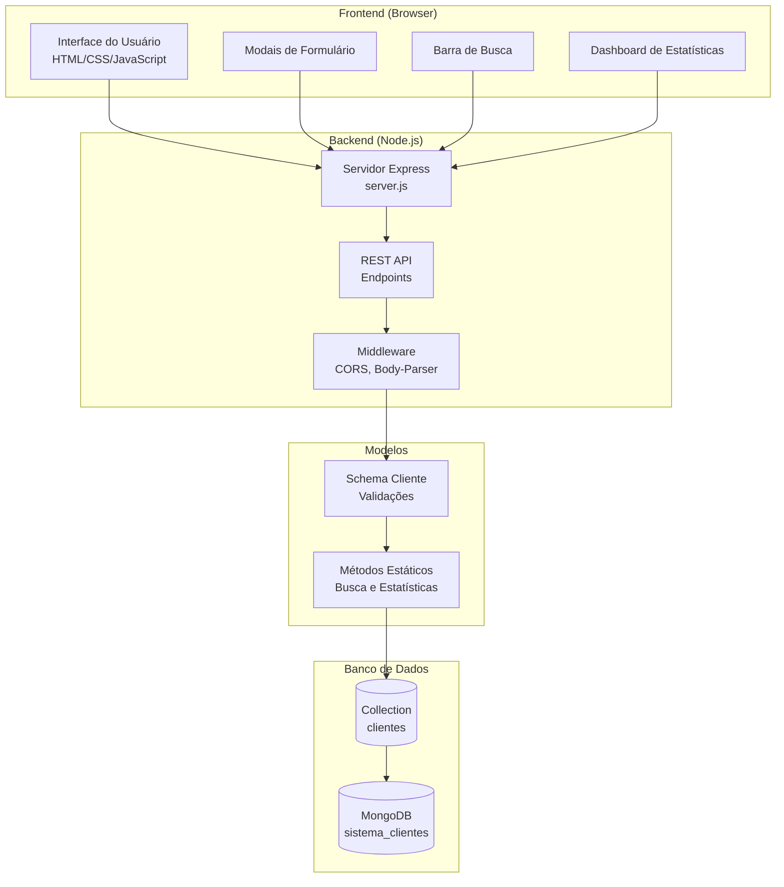
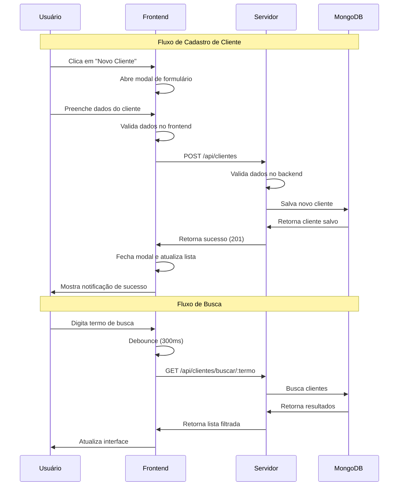
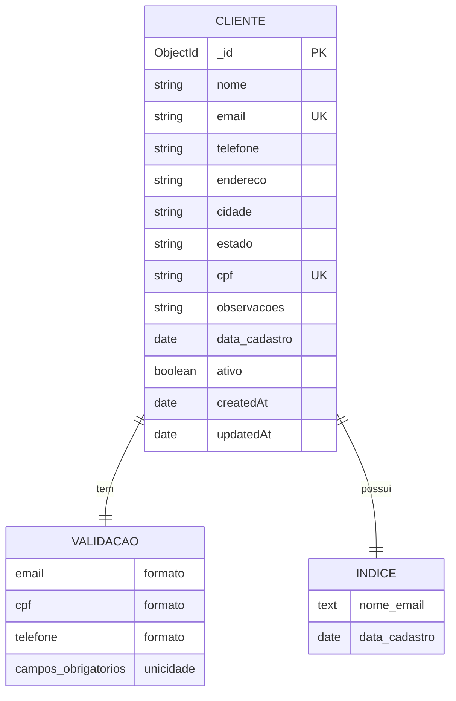
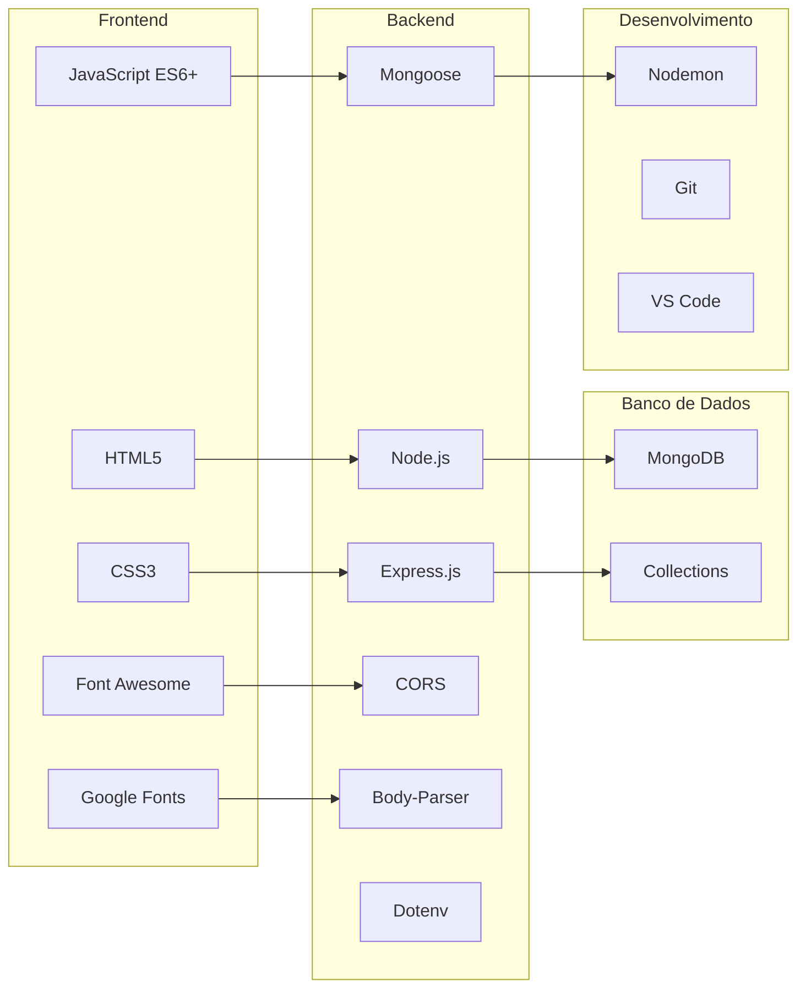
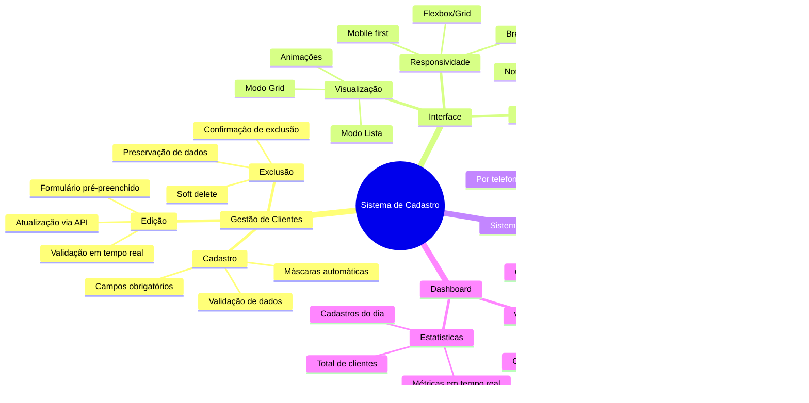
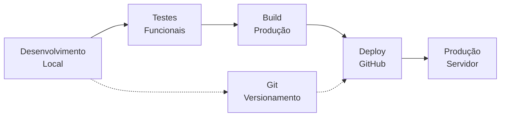
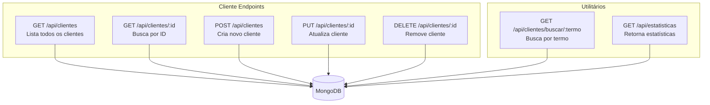
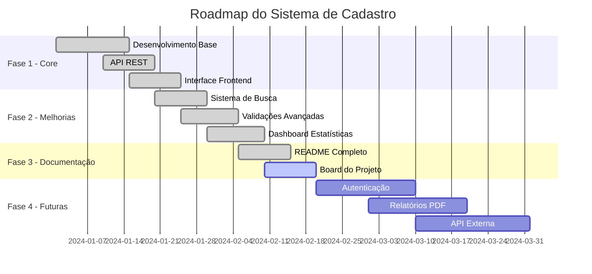

# 📋 Board do Projeto - Sistema de Cadastro de Clientes

## 🏗️ Arquitetura do Sistema



## 🔄 Fluxo de Dados da Aplicação



## 🎨 Componentes Frontend

```mermaid
graph TD
    subgraph "Estrutura HTML"
        HEADER[Cabeçalho<br/>Título + Botão Novo]
        SEARCH[Seção de Busca<br/>Input com ícone]
        STATS[Dashboard<br/>Cards de Estatísticas]
        CLIENTS[Lista de Clientes<br/>Grid/Lista View]
        MODAL[Modal de Formulário<br/>Adicionar/Editar]
        DELETE[Modal de Confirmação<br/>Exclusão]
    end
    
    subgraph "Funcionalidades JavaScript"
        LOAD[Carregar Clientes<br/>loadClients()]
        RENDER[Renderizar Lista<br/>renderClients()]
        SEARCH_FUNC[Busca em Tempo Real<br/>handleSearch()]
        VALIDATE[Validação de Formulário<br/>setupFormValidation()]
        MASKS[Máscaras de Input<br/>Telefone e CPF]
        NOTIFY[Notificações<br/>Success/Error]
    end
    
    HEADER --> MODAL
    SEARCH --> SEARCH_FUNC
    STATS --> LOAD
    CLIENTS --> RENDER
    MODAL --> VALIDATE
    MODAL --> MASKS
    DELETE --> NOTIFY
```

## 🗄️ Estrutura do Banco de Dados



## 🔧 Stack Tecnológica



## 📊 Funcionalidades por Módulo



## 🚀 Fluxo de Deploy



## 📝 Endpoints da API



## 🎯 Roadmap do Projeto



---

## 📋 Resumo do Board

### ✅ **Funcionalidades Implementadas**
- ✅ CRUD completo de clientes
- ✅ Sistema de busca inteligente
- ✅ Dashboard com estatísticas
- ✅ Interface responsiva
- ✅ Validações robustas
- ✅ Soft delete
- ✅ Documentação completa

### 🎯 **Próximos Passos Sugeridos**
- 🔐 Sistema de autenticação
- 📊 Relatórios em PDF
- 🔄 Sincronização offline
- 📱 PWA (Progressive Web App)
- 🌐 API para integração externa

### 📊 **Métricas do Projeto**
- **Arquivos**: 12 arquivos principais
- **Linhas de Código**: ~1.200 linhas
- **Tecnologias**: 8 tecnologias principais
- **Endpoints**: 7 endpoints da API
- **Funcionalidades**: 15+ funcionalidades implementadas
